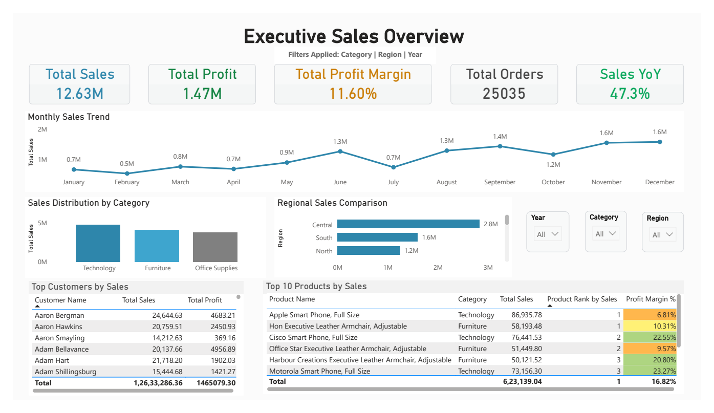
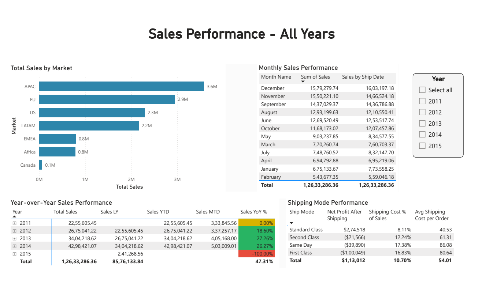
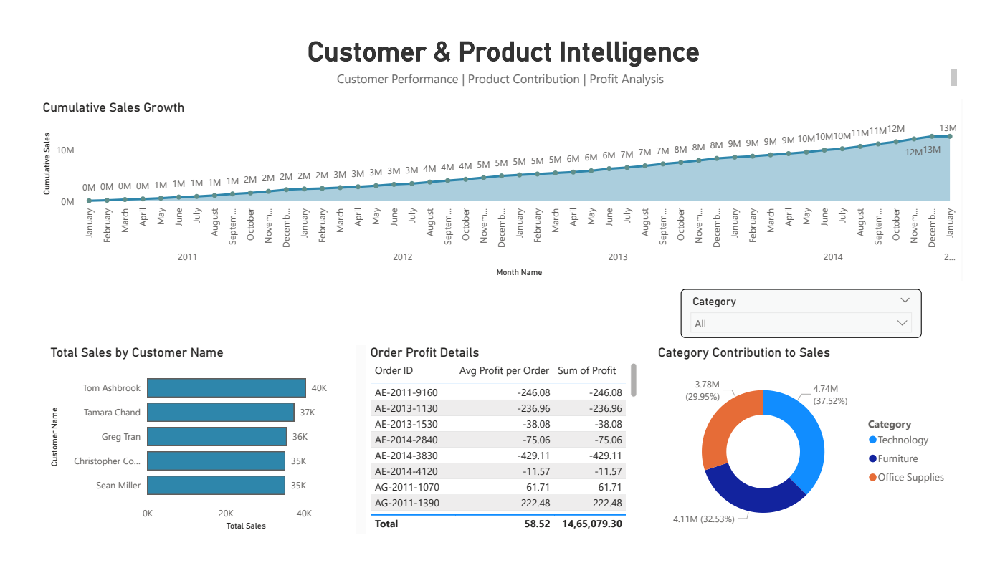
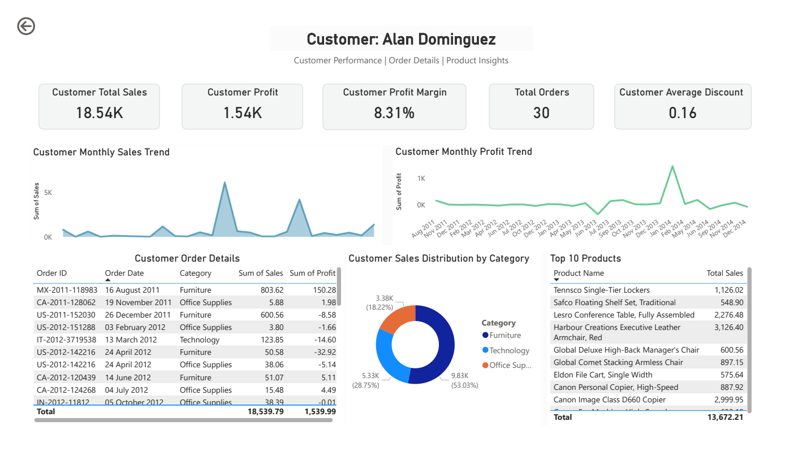

# Global Sales Analytics Dashboard | Power BI

An interactive **Power BI sales analytics project** built from the **Global Superstore** dataset to analyze revenue, profit, order trends, shipping performance, product contribution, and customer behavior across global markets.

[View Full Dashboard PDF](./GlobalSales.pdf) | [Open Power BI File](./GlobalSales.pbix) | [View Source Dataset](./Global_Superstore.xlsx)

## Dashboard Preview

  
  

  

## Project Snapshot

- Built a **4-page Power BI dashboard** for executive reporting and drill-through analysis
- Analyzed **51,290 transactions**, **25,035 orders**, and **1,590 customers**
- Covered sales activity across **147 countries** from **2011 to 2014**
- Focused on sales growth, profitability, market performance, shipping efficiency, and customer insights

## What This Dashboard Shows

### 1. Executive Sales Overview

- KPI cards for total sales, total profit, total orders, profit margin, and year-over-year sales growth
- Monthly sales trend across the year
- Sales distribution by category
- Regional sales comparison
- Top customers by sales
- Top-selling products with ranking and profit margin

### 2. Sales Performance - All Years

- Total sales by market
- Monthly sales compared with ship-date sales
- Year-over-year sales performance by year
- Shipping mode performance, including net profit after shipping and shipping cost share

### 3. Customer & Product Intelligence

- Cumulative sales growth over time
- Top customers by total sales
- Order-level profit details
- Category contribution to overall sales

### 4. Customer Drill-Through View

- Detailed customer analysis for **Alan Dominguez**
- Customer sales, profit, margin, order count, and average discount
- Monthly sales and profit trends
- Order-level detail and top purchased products
- Customer sales distribution by category

## Headline Metrics

| Metric | Value |
| --- | ---: |
| Total Sales | 12.63M |
| Total Profit | 1.47M |
| Total Orders | 25,035 |
| Total Profit Margin | 11.60% |
| Sales YoY | 47.3% |

## Key Insights

- **Technology** is the top-performing category with approximately **4.74M** in sales.
- **APAC** is the leading market, followed by **EU**, **US**, and **LATAM**.
- Sales performance strengthens toward the end of the year, with **November** and **December** emerging as the strongest months.
- **Standard Class** is the most favorable shipping mode for profitability, while faster shipping options reduce net profit after shipping.
- The dashboard supports both executive-level review and customer-level investigation through filters and drill-through navigation.

## Dataset Overview

The report is based on [`Global_Superstore.xlsx`](./Global_Superstore.xlsx), a transactional retail dataset containing:

- **51,290 records**
- **24 fields**
- **25,035 unique orders**
- **1,590 unique customers**
- **147 countries**
- Order dates from **2011-01-01** to **2014-12-31**

### Core Fields

- Order information: `Order ID`, `Order Date`, `Ship Date`, `Ship Mode`, `Order Priority`
- Customer information: `Customer ID`, `Customer Name`, `Segment`
- Geography: `City`, `State`, `Country`, `Postal Code`, `Market`, `Region`
- Product information: `Product ID`, `Category`, `Sub-Category`, `Product Name`
- Measures: `Sales`, `Quantity`, `Discount`, `Profit`, `Shipping Cost`

## Tools Used

- **Power BI Desktop**
- **Data modeling**
- **Power BI measures and calculated metrics**
- **Interactive slicers**
- **Drill-through navigation**
- **KPI, line, bar, donut, and table visuals**

## Repository Files

- [`GlobalSales.pdf`](./GlobalSales.pdf) - exported dashboard report
- [`Global_Superstore.xlsx`](./Global_Superstore.xlsx) - source dataset
- [`GlobalSales.pbix`](./GlobalSales.pbix) - editable Power BI report file
- [`assets/`](./assets) - dashboard preview images used in this README

## How to Explore

1. Open the PDF for a quick visual walkthrough of the report.
2. Open [`GlobalSales.pbix`](./GlobalSales.pbix) in **Power BI Desktop** for interactive exploration.
3. Refresh or reconnect the data source to [`Global_Superstore.xlsx`](./Global_Superstore.xlsx) if needed.
4. Use filters to analyze performance by year, category, region, and customer.

## Why This Project Matters

This project demonstrates the ability to turn raw transactional sales data into a polished business intelligence solution. It highlights dashboard design, KPI storytelling, analytical thinking, and the use of Power BI to support decision-making at both summary and detail levels.
